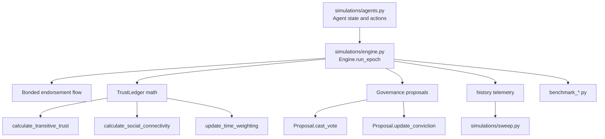
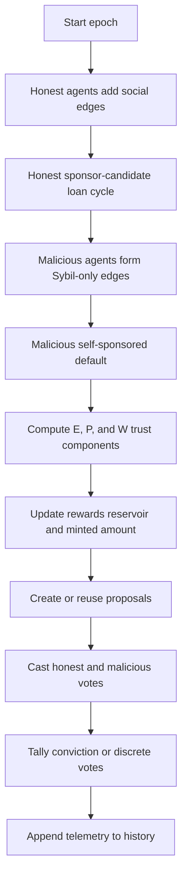

Credon Core is organized around one executable path: agent state in `simulations/agents.py`, proposal and simulation orchestration in `simulations/engine.py`, and experiment scripts in `simulations/sweep.py` plus the benchmark files. The README presents a broader protocol with contracts, rollups, and governance tokens, but this repository snapshot implements the protocol logic as a Python simulation.

## Module relationships

`Agent` is the smallest unit of state. It owns balances, loan-facing actions, governance balances, and the local interaction graph used to compute trust. `Engine` creates the agent population, mutates that state per epoch, and records aggregate telemetry. `Proposal` is embedded in `simulations/engine.py` because governance depends directly on engine-owned parameters such as `rho`, `alpha_conviction`, and total `cred_balance`.

The analytics path is intentionally thin. `simulations/sweep.py` does not introduce new model logic; it repeatedly instantiates `Engine`, tweaks a parameter like `L` or `rho`, runs epochs, and charts the resulting `history`. The benchmark scripts do the same for performance-sensitive sections such as `calculate_transitive_trust`, `calculate_social_connectivity`, and the voting loops.

## Data lifecycle

The key architectural choice is that everything happens inside `Engine.run_epoch()` in `simulations/engine.py`. That produces a compact research loop, but it also means the protocol stages are not separated into reusable services. If you want to change sponsor selection, trust math, or governance thresholds, you currently edit the same method.

## Design decisions grounded in the source

### 1. Honest and malicious behavior are modeled explicitly

The `Engine.__init__` constructor creates `H_*` and `M_*` agents with different starting balances. Honest agents start with `2500`, malicious agents with `50000`, and those asymmetries matter because the attack model assumes a Sybil operator can fund multiple bonds. That design choice lives directly in `simulations/agents.py` and is consumed by the separate honest and malicious loops inside `Engine.run_epoch()`.

Why it was made: the simulation is trying to prove incentive separation, so the code needs a visible, adversarial branch rather than one neutral actor model. The result is easy to inspect in epoch telemetry, especially `avg_h_roi` versus `avg_m_roi`.

### 2. Trust is decomposed into three independent signals

`Engine.calculate_trust_scores()` in `simulations/engine.py` combines:

- `calculate_transitive_trust()` for EigenTrust-style propagation.
- `calculate_social_connectivity()` for PageRank-style graph centrality.
- `update_time_weighting()` for an EMA over verified recent activity.

Why it was made: each term captures a different failure mode. Transitive trust rewards trusted neighbors, connectivity discourages isolated cliques, and time weighting keeps dormant accounts from carrying old reputation forever. The code reflects this explicitly with weights `alpha`, `beta`, and `gamma`.

### 3. Interaction weights are throttled before trust propagation

Inside `calculate_transitive_trust()`, edge weights are square-rooted before normalization. The changelog in `simulations/CHANGELOG.md` calls this out as a deliberate change. It dampens the effect of raw volume so a single heavy interaction does not dominate the graph.

Why it was made: the simulation is trying to resist wash-trading and concentrated interaction farms. Square-root throttling compresses large edges without erasing the signal entirely.

### 4. Governance uses conviction for core policy changes

`Proposal.update_conviction()` accumulates `y_t_yes` and `y_t_no`, and `Engine.run_epoch()` compares them against a steady-state threshold derived from `alpha_conviction`. That is a simplification of conviction-voting systems, but it matches the repo's stated goal of slowing down governance capture.

Why it was made: the reward release rate `rho` is the most inflation-sensitive variable in the model, so the code treats it as a slow-moving, stake-accumulating decision rather than a one-epoch snapshot vote.

### 5. Performance shortcuts are visible in the core loop

The engine precomputes `honest_ids` and `malicious_ids` during initialization and pre-categorizes proposals into "reasonable" and "extreme" buckets before voting. The benchmark scripts focus on those same areas.

Why it was made: `run_epoch()` is already complex enough to trip the Ruff McCabe threshold, and without these shortcuts the sweeps and benchmarks would spend more time on repeated filtering than on the protocol logic itself.

## Known implementation boundaries

<Callout type="warn">The current checkout is best understood as a simulation workspace, not a polished package. There is no `pyproject.toml` or `requirements.txt`, `contracts/` only contains placeholders, and `simulations/engine.py` currently uses `from agents import Agent`, which is convenient for direct script execution but awkward for package-style imports.</Callout>

There is another source-level inconsistency near the `Proposal.create_batch_updates` and `Proposal.cast_votes_batch` helpers in `simulations/engine.py`. The changelog says the batch update bug was fixed, but this checkout still contains duplicated method declarations. The rest of the code path does not rely on those helpers, so the main conceptual architecture remains clear even though that section needs cleanup before packaging.

## How the pieces fit together

If you are reading the code from top to bottom, the most productive order is:

1. `simulations/agents.py` for the data model and primitive actions.
2. `simulations/engine.py` for the epoch lifecycle, trust math, rewards, and governance.
3. `simulations/sweep.py` to see how the engine is used for repeatable experiments.
4. `simulations/benchmark_*.py` to understand which parts the author considered performance-sensitive.

From there, move to [Bonded Endorsements](/docs/bonded-endorsements), [Trust Ledger](/docs/trust-ledger), and [Governance and Monetary Policy](/docs/governance-and-monetary-policy), then use the API pages for exact signatures and parameters.
