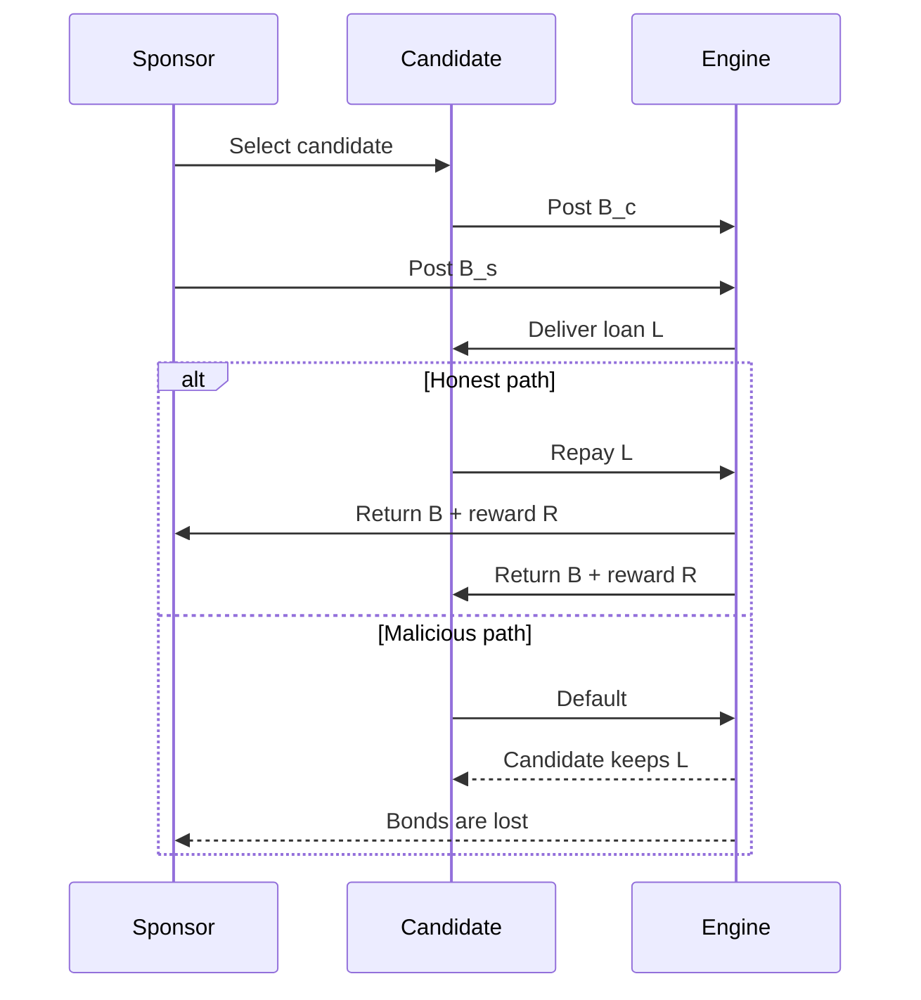

Bonded endorsements are the simulation's answer to the basic Sybil problem: how do you let new participants access credit without letting an attacker spin up costless fake identities? In Credon Core, both the sponsor and the candidate post a bond `B`, the candidate receives a loan `L`, and the payoff diverges sharply depending on whether the borrower repays or defaults.

## Why this concept exists

The README frames Credon as a system where reputation replaces conventional collateral. That only works if entry into the system is itself costly and socially anchored. `simulations/agents.py` implements that idea with `Agent.try_sponsor()` and `Agent.post_candidate_bond()`, while `Engine.run_epoch()` in `simulations/engine.py` decides when those actions happen and what counts as a successful graduation.

This concept sits underneath both of the other major systems:

- The TrustLedger needs repeated, successful interactions to score honest actors.
- Governance needs `cred_balance`, and `Agent.process_graduation()` mints one unit of `CRED` per verified activity.

Without bonded endorsements, there would be no meaningful distinction between honest repayment and malicious self-dealing.



## How it works internally

The primitive actions are all in `simulations/agents.py`:

- `try_sponsor(candidate_id, current_epoch)` debits `self.B` and returns a loan record.
- `post_candidate_bond()` debits the candidate-side bond and returns the posted amount.
- `receive_loan(loan_amount)` increases balance by the principal.
- `repay_loan(loan_amount, loan_record)` marks the record as `repaid` and removes the loan amount from balance.
- `process_graduation(bond_returned, reward)` restores balance and mints one unit of `cred_balance`.
- `execute_default(loan_record)` marks the record as `defaulted`.

`Engine.run_epoch()` wires those pieces together in two separate behavioral branches.

For honest agents:

1. The sponsor interacts with up to three honest peers to build graph edges.
2. If the sponsor has enough balance, the engine randomly picks an honest candidate.
3. The candidate posts `B_c`, the sponsor posts `B_s`, and the candidate receives `L`.
4. The simulation resolves repayment immediately in the same epoch.
5. Both accounts get their bond back plus reward `R`, and both gain one verified-activity count plus one `CRED`.

For malicious agents:

1. The attacker creates dense interactions only with other malicious agents.
2. The same account effectively sponsors itself.
3. It posts both bonds, takes the loan, defaults, and keeps `L`.
4. The engine burns the two bonds from circulating supply and records the attacker-favorable but still negative expected value `L - 2B`.

That honest-versus-malicious split is the core of the protocol claim. The simulation is not trying to eliminate attacks entirely; it is trying to make the attack path economically unattractive over time.

## Basic usage

This example uses only the `Agent` primitive to show the endorsement cycle in isolation.

```python
from simulations.agents import Agent

sponsor = Agent(agent_id="H_0")
candidate = Agent(agent_id="H_1")

record = sponsor.try_sponsor(candidate_id=candidate.id, current_epoch=1)
posted = candidate.post_candidate_bond()

if record and posted == candidate.B:
    candidate.receive_loan(candidate.L)
    if candidate.repay_loan(candidate.L, record):
        sponsor.process_graduation(sponsor.B, sponsor.R)
        candidate.process_graduation(candidate.B, candidate.R)

print(record["status"])
print(sponsor.cred_balance, candidate.cred_balance)
```

## Advanced scenario

The malicious path is intentionally simple: one account self-funds the attack and defaults.

```python
from simulations.agents import Agent

attacker = Agent(agent_id="M_0", is_malicious=True)
record = attacker.try_sponsor(candidate_id=attacker.id, current_epoch=1)
candidate_bond = attacker.post_candidate_bond()

if record and candidate_bond == attacker.B:
    attacker.receive_loan(attacker.L)
    attacker.execute_default(record)

print(record["status"])
print(attacker.balance)
```

This is a useful edge-case test because it shows what the simulation is actually claiming: not that the loan cannot be stolen, but that stealing it should still destroy enough value through lost bonds that repeated Sybil behavior remains unattractive.

<Callout type="warn">`Engine.run_epoch()` resolves honest loans inside the same epoch. That means the model is good for incentive reasoning but not for delinquency timing, repayment schedules, or cross-epoch credit exposure. If you need those behaviors, the current simulation must be refactored rather than merely re-parameterized.</Callout>

## Relationship to other concepts

Bonded endorsements feed directly into the other two systems:

- Every successful graduation increments `recent_activity`, which later influences the time-weighted trust term `W`.
- Every successful graduation also increments `cred_balance`, which is the governance voting power used by `Proposal.cast_vote()`.

This is the key design point in the codebase. Trust, access to capital, and governance are not parallel tracks. They all branch from the same success-or-default outcome.

<Accordions>
<Accordion title="Trade-off: immediate settlement versus realistic credit duration">

The simulation resolves the honest sponsor-candidate cycle in the same epoch because the engine is optimized for repeated policy experiments, not for credit accounting fidelity. That makes `run_epoch()` easy to reason about: a successful cycle immediately contributes to verified volume, reputation, and `CRED` issuance.

The downside is that duration risk disappears. There is no notion of a borrower occupying liquidity for multiple epochs, no late repayment state, and no path where social trust improves while short-term cash flow degrades.

If you extend this model, the first structural change should be turning `active_loans` into a true multi-epoch state machine rather than a same-tick bookkeeping list.

</Accordion>
<Accordion title="Trade-off: symmetric bonds simplify incentives but flatten social nuance">

Both sponsor and candidate post `B`, and the code treats those bonds as identical amounts. That keeps the honest path and malicious path easy to compare because the attacker expected value reduces cleanly to `L - 2B`.

The downside is that the model cannot express stronger sponsors, weaker candidates, or graduated vouching requirements. In a richer system you might want `B_s` to scale with sponsor reputation and `B_c` to scale with requested credit.

The current model intentionally avoids that complexity so the attack economics stay legible.

</Accordion>
<Accordion title="Trade-off: high malicious starting capital stresses the system but is not neutral">

Malicious agents start with `50000` balance in `simulations/agents.py`, while honest agents start with `2500`. That asymmetry is useful because it pressure-tests the mechanism against a well-funded adversary rather than a toy attacker.

It also means you should be careful when reading raw balance changes, because the initial bankroll difference can visually dominate the results even when the malicious ROI trend is poor.

If you compare populations or run new sweeps, focus on `avg_h_roi`, `avg_m_roi`, and trust divergence rather than absolute balances alone.

</Accordion>
</Accordions>

From here, continue to [Trust Ledger](/docs/trust-ledger) to see how these interactions become scores, or jump to the [Agent API page](/docs/api-reference/agent) for method signatures.
