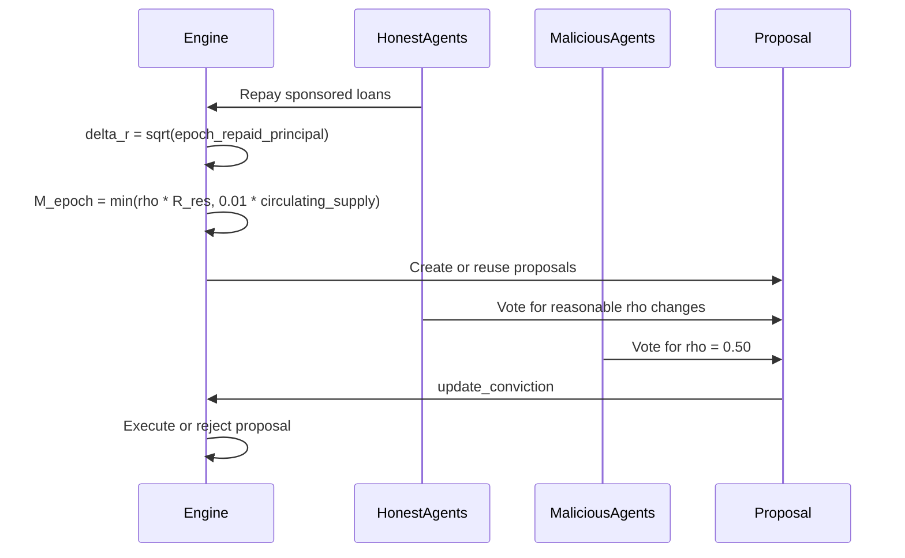

Credon Core does not treat governance as a separate subsystem. Monetary policy, proposal creation, vote casting, and proposal execution all happen during `Engine.run_epoch()` in `simulations/engine.py`. That matters because policy changes are evaluated against the same state that loans and trust scoring just updated.

## What this concept is

There are two intertwined mechanisms:

- A rewards reservoir `R_res` that accumulates as verified volume grows.
- A governance process that can adjust `rho`, the reward release rate applied to that reservoir.

In practice, the engine computes verified volume from honest repayments, updates `R_res`, mints at most `min(rho * R_res, 0.01 * circulating_supply)`, and then lets agents propose or vote on `rho` changes with `cred_balance`.

## Why it exists

If rewards were minted linearly from all activity without a throttle, attack-driven volume could inflate the system quickly. If governance could change `rho` with a simple one-shot vote, a temporary coalition might force a large release rate increase. Credon Core addresses both by:

- Throttling minting against circulating supply.
- Using conviction accumulation for core proposals.
- Minting governance power only through successful participation.

The result is a feedback loop where policy power emerges from verified activity instead of from starting capital alone.



## How it works internally

### Rewards reservoir and throttle

Near the middle of `run_epoch()`, the engine computes:

```python
delta_r = math.sqrt(epoch_repaid_principal)
self.R_res += delta_r
M_epoch = min(self.rho * self.R_res, 0.01 * self.circulating_supply)
```

This is a two-layer throttle. First, verified volume enters the reservoir sub-linearly through `sqrt`. Second, the amount minted in a single epoch cannot exceed one percent of circulating supply, even if `rho * R_res` is larger.

### Proposal creation

The engine then inspects inflation pressure and reservoir size:

- If inflation exceeds `0.02`, honest agents prefer a slightly lower `rho`.
- If inflation is below `0.02` and the reservoir is sufficiently full, honest agents prefer a slightly higher `rho`.
- Malicious agents always prefer `rho = 0.50`.

When there is no active proposal matching a target, the engine creates a new `Proposal` object with `is_core=True`.

### Vote casting and execution

Honest agents divide proposals into "reasonable" and "extreme" relative to current `rho`. They vote yes on reasonable changes and no on extreme ones. Malicious agents do the reverse, prioritizing the hyperinflationary target.

Each `Proposal` stores votes as:

```python
{
    "agent_id": {
        "amount": amount,
        "epoch_staked": current_epoch,
        "vote": True or False
    }
}
```

`Proposal.update_conviction()` updates `y_t_yes` and `y_t_no`. For core proposals, the engine compares those accumulated values against a threshold derived from total `cred_balance` and `alpha_conviction`. If yes-conviction exceeds the threshold and beats no-conviction, the engine updates `self.rho` and marks the proposal as executed.

The file also includes a branch for non-core proposals with simple quorum and approval checks, although the current epoch loop only auto-creates core proposals.

## Basic usage

The smallest governance example is a standalone proposal.

```python
from simulations.engine import Proposal

proposal = Proposal(
    prop_id=1,
    proposer_id="H_0",
    target_rho=0.06,
    creation_epoch=1,
    is_core=True,
)

proposal.cast_vote(agent_id="H_1" amount=10 vote=True, current_epoch=1)
proposal.cast_vote(agent_id="H_2" amount=5 vote=False, current_epoch=1)

print(proposal.update_conviction(alpha=0.8, t_max=5, current_epoch=1))
print(proposal.y_t_yes, proposal.y_t_no)
```

## Advanced scenario

This example lets the engine create and process proposals naturally.

```python
from engine import Engine

engine = Engine(num_honest=20, num_malicious=5)

for _ in range(10):
    engine.run_epoch()

print(engine.rho)
print([(p.id, p.target_rho, p.status) for p in engine.proposals])
```

This is the most realistic way to see the policy loop, because proposal creation depends on emergent conditions like `inflation_rate`, `R_res`, and the total `cred_balance` earned by prior successful interactions.

<Callout type="warn">`cred_balance` is minted only through `Agent.process_graduation()`. Because malicious accounts default in the default model, they usually have little or no direct governance power. If you alter the attack path or reward path, revisit the governance assumptions immediately because the current safety story depends on that coupling.</Callout>

## How it relates to other concepts

Governance depends on both of the other core abstractions:

- Bonded endorsements create the verified activity that fills `R_res`.
- Trust-related honest behavior is what lets agents repay, graduate, and accumulate `cred_balance`.

The architectural consequence is that governance is not permissionless in the same way as token-only DeFi systems. In this simulation, you must behave well enough in the lending layer before you can shape monetary policy.

<Accordions>
<Accordion title="Trade-off: conviction voting resists flash capture, but it slows legitimate policy moves">

Accumulating `y_t_yes` and `y_t_no` over time is a deliberate brake. A policy change needs sustained support rather than one lucky epoch with concentrated turnout.

That is good for protecting `rho`, which controls how fast rewards leave the reservoir. The downside is that the system reacts slowly even when conditions genuinely change.

If you simulate shocks or emergencies, conviction voting may under-correct unless you add an explicit fast-path governance mechanism.

</Accordion>
<Accordion title="Trade-off: auto-generated proposal heuristics make experiments easier, but they are not neutral governance agents">

The engine decides when honest agents should want a slightly higher or lower `rho` based on inflation and reservoir size. That is useful because it keeps the simulation moving without requiring an external strategy layer.

It also means the results partly encode the author's policy assumptions. A different heuristic would produce different governance traffic even with the same underlying repayment behavior.

Treat the current proposal-generation logic as a scenario policy, not as a mathematically inevitable outcome.

</Accordion>
<Accordion title="Trade-off: the mint throttle stabilizes supply, but it hides distribution details">

`M_epoch` is capped against circulating supply, which is the strongest anti-runaway-inflation guard in the file. However, the code does not model who specifically receives the newly minted amount after it leaves `R_res`; it simply increases `circulating_supply`.

That abstraction is fine for high-level system dynamics but weak for treasury accounting or fairness analysis.

If your next question is "who got paid and why," the current implementation is too coarse and needs a real distribution model.

</Accordion>
</Accordions>

Continue with the [Architecture page](/docs/architecture) for the full epoch lifecycle or the [Proposal API page](/docs/api-reference/proposal) for constructor and method signatures.
