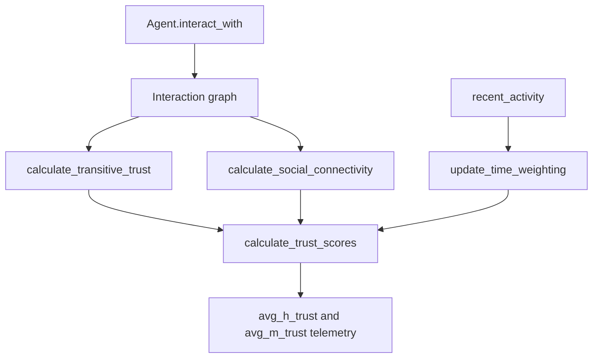

The TrustLedger is the part of Credon Core that turns interactions into reputation. In code, it is not a standalone class. It is a set of methods on `Engine` in `simulations/engine.py`, and those methods compute three signals that are finally combined into a single score `T`.

## What the TrustLedger is solving

If the protocol only counted successful repayments, an attacker could build reputation inside a closed clique. If it only measured graph centrality, old but inactive accounts would retain too much influence. If it only measured recent activity, the system would forget long-term reliability too quickly.

The TrustLedger addresses that by blending:

- Transitive trust `E`: how much trust flows through the interaction graph.
- Social connectivity `P`: how central an account is in the network.
- Time weighting `W`: how recently the account participated in verified activity.

Those three terms are combined in `Engine.calculate_trust_scores()` as:

```python
T[a] = (self.alpha * E[a]) + (self.beta * P[a]) + (self.gamma * W[a])
```

## How it relates to the rest of the library

Bonded endorsements create the raw interaction edges through `Agent.interact_with()`. Governance consumes the resulting social outcomes indirectly because successful interactions also mint `cred_balance`, and the engine prints average trust divergence as one of its core telemetry signals. In other words, the TrustLedger is the bridge between transactional behavior and system-level policy confidence.



## How it works internally

### 1. Transitive trust

`Engine.calculate_transitive_trust()` converts the interaction graph into an EigenTrust-style propagation process.

- It enumerates all agent IDs and creates integer indexes for array-based updates.
- For each source node, it computes `total_interactions` as the sum of the square root of edge weights.
- It normalizes each outgoing edge by that square-rooted total and stores the result in a flat edge list.
- It iterates five times, pushing trust mass across edges and renormalizing to roughly `num_agents`.

The square-root step is critical. It means a weight of `100` is influential, but not ten times more influential than a weight of `10`. The changelog explicitly calls out this throttle as a deliberate Sybil-resistance improvement.

### 2. Social connectivity

`Engine.calculate_social_connectivity()` is a PageRank-style computation.

- It starts with a uniform prior over all agents.
- It uses damping `d = 0.85`.
- It precomputes normalized outgoing weights for each agent to avoid recomputing out-degree in every iteration.
- It also identifies sink nodes and redistributes their contribution across the whole network.

This is why the benchmark suite includes `benchmark_pagerank.py`: sink-heavy graphs are a realistic edge case for a social-credit system where many accounts may have no outgoing activity.

### 3. Time weighting

`Engine.update_time_weighting()` computes `W` with a simple exponential moving average:

```python
self.W[agent_id] = (activity * self.ema_decay) + (self.W[agent_id] * (1 - self.ema_decay))
```

The engine resets `recent_activity[agent_id]` after each update, so `W` captures a smoothed record of recent verified behavior rather than a cumulative lifetime total.

## Basic usage

You can inspect trust before any epochs run. With no interactions, all scores collapse toward zero because there is no graph to propagate through.

```python
from simulations.engine import Engine

engine = Engine(num_honest=3, num_malicious=1)
scores = engine.calculate_trust_scores()

print(scores)
```

That is a useful baseline when you are testing how much of the later separation comes from interaction topology rather than initial balances.

## Advanced scenario

This example creates a small mutual-trust pocket to show how the transitive term can concentrate around connected participants.

```python
from simulations.engine import Engine

engine = Engine(num_honest=3, num_malicious=1)

for agent in engine.agents.values():
    agent.interactions = {}

engine.agents["H_0"].interact_with("H_1", value=10)
engine.agents["H_1"].interact_with("H_0", value=10)

e_scores = engine.calculate_transitive_trust()
p_scores = engine.calculate_social_connectivity()
t_scores = engine.calculate_trust_scores()

print(e_scores["H_0"], e_scores["H_1"])
print(p_scores["H_0"], p_scores["H_1"])
print(t_scores["H_0"], t_scores["H_1"])
```

The tests in `simulations/test_engine.py` assert the same qualitative property: the mutually connected pair traps trust mass while disconnected nodes collapse toward zero.

<Callout type="warn">Disconnected or acyclic graphs can drive transitive trust to zero for everyone after repeated propagation. That is not a bug in the docs; it follows directly from the fixed-iteration implementation in `calculate_transitive_trust()` and is covered by the chain-graph tests in `simulations/test_engine.py`.</Callout>

## Practical reading of the scores

The engine itself never uses `T_scores` to gate loans or votes. Instead, it records average honest and malicious trust in `history` and prints those values at the end of each epoch. That is an important architectural boundary. In this checkout, trust is a measurement layer, not yet an access-control layer.

That design makes the simulation useful for research: you can experiment with weights, graph structures, and attack strategies without also changing execution rights. It also means downstream policies like loan size by trust band or sponsor eligibility by trust threshold are still future work.

<Accordions>
<Accordion title="Trade-off: square-root weighting reduces wash trading, but it also compresses legitimate high-volume relationships">

The square-root normalization in `calculate_transitive_trust()` is a clear anti-manipulation choice. A dense clique cannot multiply trust linearly just by sending the same huge notional volume back and forth.

The cost is that genuinely productive, high-frequency counterparties also lose expressive power because large edges are intentionally flattened.

If you later add transaction quality or diversity metrics, keep the square-root throttle but consider adding a separate feature rather than removing the compression entirely.

</Accordion>
<Accordion title="Trade-off: fixed iteration counts keep the model cheap, but they are not convergence-aware">

Transitive trust uses five iterations and social connectivity uses ten. Those constants make the benchmark scripts predictable and keep each epoch lightweight enough for sweeps.

The downside is that the engine does not check convergence, spectral gaps, or graph size before stopping. On a larger or more irregular network, the values might reflect the chosen iteration budget as much as the graph itself.

If you need stronger numerical guarantees, expose the iteration count and a tolerance check as first-class engine parameters.

</Accordion>
<Accordion title="Trade-off: EMA activity is easy to reason about, but it couples trust recency to epoch granularity">

`update_time_weighting()` resets `recent_activity` after each epoch and uses a single `ema_decay` value. That makes the recency model transparent and cheap, which is ideal for policy exploration.

It also means the meaning of one unit of recency changes whenever you redefine what an epoch is. A daily epoch and a monthly epoch would produce very different trust inertia under the same `ema_decay`.

If you operationalize this model, normalize decay against real time instead of only simulation ticks.

</Accordion>
</Accordions>

For policy mechanics built on top of these scores, continue to [Governance and Monetary Policy](/docs/governance-and-monetary-policy). For exact method signatures, see the [Engine API](/docs/api-reference/engine).
